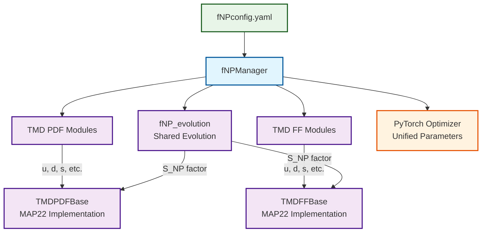
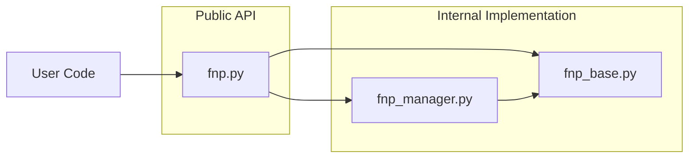

# Modular fNP System Documentation

**Author:** Chiara Bissolotti (<cbissolotti@anl.gov>)  
**Version:** 2.0.0  
**Purpose:** Unified TMD PDF and FF non-perturbative parameterization with MAP22 implementation

---

## Table of Contents

- [Modular fNP System Documentation](#modular-fnp-system-documentation)
  - [Table of Contents](#table-of-contents)
  - [1. Overview](#1-overview)
  - [2. Architecture](#2-architecture)
  - [3. File Structure](#3-file-structure)
  - [4. `fnp_base.py`](#4-fnp_basepy)
    - [4.1. Evolution Module (`fNP_evolution`)](#41-evolution-module-fnp_evolution)
    - [4.2. TMD PDF Base (`TMDPDFBase`)](#42-tmd-pdf-base-tmdpdfbase)
    - [4.3. TMD FF Base (`TMDFFBase`)](#43-tmd-ff-base-tmdffbase)
  - [5. `fnp_manager.py`](#5-fnp_managerpy)
    - [5.1 Class `fNPManager`](#51-class-fnpmanager)
  - [6. `fnp.py` - The Main Interface Module](#6-fnppy---the-main-interface-module)
    - [6.1. What is `fnp.py` and Why Do We Need It?](#61-what-is-fnppy-and-why-do-we-need-it)
    - [6.2. Architecture Role](#62-architecture-role)
    - [6.3. Why This Design?](#63-why-this-design)
      - [**1. Clean Import Interface**](#1-clean-import-interface)
      - [**2. API Stability**](#2-api-stability)
      - [**3. Selective Exports**](#3-selective-exports)
      - [**4. Documentation Entry Point**](#4-documentation-entry-point)
    - [6.4. What Does `fnp.py` Actually Do?](#64-what-does-fnppy-actually-do)
    - [6.5. Could We Eliminate `fnp.py`?](#65-could-we-eliminate-fnppy)
  - [7. Configuration Structure](#7-configuration-structure)
    - [Complete Example (`fNPconfig.yaml`)](#complete-example-fnpconfigyaml)
  - [7. Usage Examples](#7-usage-examples)
    - [7.1. Basic Usage](#71-basic-usage)
    - [7.2. Optimization Example](#72-optimization-example)
    - [7.3. Parameter Analysis](#73-parameter-analysis)

---

## 1. Overview

- **Unified PDF/FF Management**: Simultaneous optimization of both TMD PDFs and FFs
- **MAP22 Implementation**: Exact implementation of the MAP22 parameterization from NangaParbat
- **Shared Evolution**: Common evolution factor across PDFs and FFs
- **Modular Design**: Clean separation of concerns with reusable components
- **Configuration**: Comprehensive YAML-based parameter management

## 2. Architecture



## 3. File Structure

```bash
map/modules/
├── fnp_base.py          # Base classes (Evolution, PDF, FF)
├── fnp_manager.py       # Unified manager for PDFs and FFs
└── fnp.py               # Main interface and exports

map/inputs/ 
└── fNPconfig.yaml       # New unified configuration

map/tests/
├── test_fnp_modular.py    # Comprehensive test suite
└── other test files...

map/docs/
└── fnp.md         # This documentation
```

## 4. `fnp_base.py`

### 4.1. Evolution Module (`fNP_evolution`)

**Purpose:** Shared evolution factor for both TMD PDFs and FFs.

Implementation of

```latex
S_NP(ζ, b_T) = exp[-g₂² b_T²/4 × ln(ζ/Q₀²)]
```

**Key Features:**

- Single trainable parameter `g2`
- Shared across all PDF and FF flavors
- Parameter masking support
- Reference scale Q₀² = 1 GeV²

### 4.2. TMD PDF Base (`TMDPDFBase`)

**Purpose:** MAP22 TMD PDF parameterization with 11 parameters.

### 4.3. TMD FF Base (`TMDFFBase`)

**Purpose:** Exact MAP22 TMD FF parameterization with 9 parameters.

## 5. `fnp_manager.py`

Unified Manager for TMD PDFs and FFs.

### 5.1 Class `fNPManager`

**Purpose:** Single interface for managing both TMD PDFs and FFs.

**Key Features:**

- Unified parameter optimization
- Shared evolution factor management
- Per-flavor configuration
- Comprehensive parameter analysis
- PyTorch optimizer compatibility

## 6. `fnp.py` - The Main Interface Module

### 6.1. What is `fnp.py` and Why Do We Need It?

**The Question:** "*Why do we need `fnp.py` when we already have `fnp_manager.py`?*"

**The Answer:** `fnp.py` serves as a **package interface layer** that provides a clean, stable API for users while hiding the internal complexity of the modular system.

### 6.2. Architecture Role



### 6.3. Why This Design?

#### **1. Clean Import Interface**

Without `fnp.py`:

```python
# User needs to know internal structure
from modules.fnp_manager import fNPManager as fNP
from modules.fnp_base import TMDPDFBase, TMDFFBase
```

With `fnp.py`:

```python
# Clean, simple imports
from modules.fnp import fNP, TMDPDFBase, TMDFFBase
```

#### **2. API Stability**

- Internal refactoring doesn't break user code
- Import paths remain consistent
- Version compatibility maintained

#### **3. Selective Exports**

`fnp.py` explicitly controls what's available to users:

```python
__all__ = [
    "fNP",                    # Main interface (most users need this)
    "fNPManager",             # Advanced users
    "TMDPDFBase",             # For custom implementations
    "TMDFFBase",              # For custom implementations
    # Internal utilities are NOT exported
]
```

#### **4. Documentation Entry Point**

- Single place to document the entire system
- Version information
- Usage examples

### 6.4. What Does `fnp.py` Actually Do?

`fnp.py` is essentially a **re-export module** that:

1. **Imports** all components from `fnp_base.py` and `fnp_manager.py`
2. **Re-exports** them with clean names
3. **Provides** version info and documentation
4. **Defines** `__all__` for controlled exports

**The Code:**

```python
# Re-export the main classes and functions from the modular system
from .fnp_base import (
    fNP_evolution,
    TMDPDFBase, 
    TMDFFBase,
    MAP22_DEFAULT_*
)

from .fnp_manager import fNPManager, fNP

# Make the main interface easily accessible
__all__ = ["fNP", "fNPManager", ...]
```

### 6.5. Could We Eliminate `fnp.py`?

**Yes, technically**, but it would:

- ❌ Force users to know internal module structure
- ❌ Make imports longer and more complex  
- ❌ Break existing code if we reorganize internally
- ❌ Violate Python packaging best practices

**The current design follows Python conventions** used by major packages like NumPy, PyTorch, etc.

## 7. Configuration Structure

### Complete Example (`fNPconfig.yaml`)

```yaml
# Global settings
hadron: proton
zeta: 1.0

# Shared evolution factor
evolution:
  init_g2: 0.12840
  free_mask: [true]

# TMD PDFs (11 parameters each)
pdfs:
  u:
    init_params: [0.28516, 2.9755, 0.17293, 0.39432, 0.28516, 0.28516, 0.39432, 2.9755, 2.9755, 0.17293, 0.17293]
    free_mask: [true, true, true, true, true, true, true, true, true, true, true]
  d:
    init_params: [0.25000, 2.8000, 0.16000, 0.35000, 0.25000, 0.25000, 0.35000, 2.8000, 2.8000, 0.16000, 0.16000]
    free_mask: [true, true, true, true, true, true, true, true, true, true, true]
  # ... other flavors with reduced complexity

# TMD FFs (9 parameters each)
ffs:
  u:
    init_params: [0.21012, 2.12062, 0.093554, 0.25246, 5.2915, 0.033798, 2.1012, 0.093554, 0.25246]
    free_mask: [true, true, true, true, true, true, true, true, true]
  d:
    init_params: [0.19000, 2.00000, 0.090000, 0.24000, 5.0000, 0.030000, 2.0000, 0.090000, 0.24000]
    free_mask: [true, true, true, true, true, true, true, true, true]
  # ... other flavors with reduced complexity
```

**Parameter Summary:**

- **Total**: 161 parameters (1 evolution + 8×11 PDFs + 8×9 FFs)
- **Trainable**: ~70 parameters (varies based on masking strategy)
- **Strategy**: Full complexity for u,d; reduced for sea quarks; minimal for heavy quarks

## 7. Usage Examples

### 7.1. Basic Usage

```python
import torch
import yaml
from modules.fnp_manager import fNPManager

# Load configuration
with open('map/inputs/fNPconfig_unified.yaml', 'r') as f:
    config = yaml.safe_load(f)

# Initialize manager
fnp_manager = fNPManager(config)

# Evaluate TMD PDFs
x = torch.tensor([0.1, 0.3, 0.5])
b = torch.tensor([0.5, 1.0, 1.5])

pdf_results = fnp_manager.forward_pdf(x, b, flavors=['u', 'd'])
print(f"PDF u: {pdf_results['u']}")
print(f"PDF d: {pdf_results['d']}")

# Evaluate TMD FFs
z = torch.tensor([0.2, 0.4, 0.7])
ff_results = fnp_manager.forward_ff(z, b, flavors=['u', 'd'])
print(f"FF u: {ff_results['u']}")
print(f"FF d: {ff_results['d']}")
```

### 7.2. Optimization Example

```python
# Set up optimizer
optimizer = torch.optim.Adam(fnp_manager.parameters(), lr=0.001)

# Training loop
for epoch in range(num_epochs):
    optimizer.zero_grad()
    
    # Forward pass
    pdf_results = fnp_manager.forward_pdf(x_data, b_data, flavors=['u', 'd'])
    ff_results = fnp_manager.forward_ff(z_data, b_data, flavors=['u', 'd'])
    
    # Compute loss (example)
    pdf_loss = torch.nn.functional.mse_loss(pdf_results['u'], target_pdf_u)
    ff_loss = torch.nn.functional.mse_loss(ff_results['u'], target_ff_u)
    total_loss = pdf_loss + ff_loss
    
    # Backward pass
    total_loss.backward()
    optimizer.step()
    
    if epoch % 100 == 0:
        print(f"Epoch {epoch}, Loss: {total_loss.item():.6f}")
```

### 7.3. Parameter Analysis

```python
# Get parameter information
param_info = fnp_manager.get_parameter_info()
print(f"Total parameters: {param_info['total_parameters']}")
print(f"Trainable parameters: {param_info['truly_trainable_parameters']}")

# Print detailed summary
fnp_manager.print_parameter_summary()

# Extract trainable parameters for saving
trainable_params = fnp_manager.get_trainable_parameters_dict()
torch.save(trainable_params, 'fitted_parameters.pth')

# Load parameters
loaded_params = torch.load('fitted_parameters.pth')
fnp_manager.set_trainable_parameters_dict(loaded_params)
```
