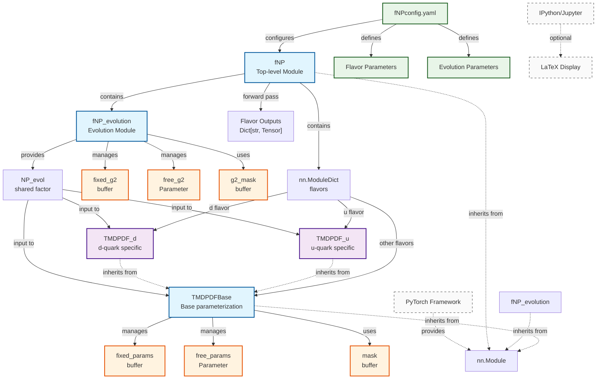

# fNP Module Documentation

**Author:** Chiara Bissolotti (<cbissolotti@anl.gov>)  
**Module:** `map/modules/fNP.py`  
**Purpose:** Non-perturbative TMD PDF parameterization using PyTorch

---

## Table of Contents

- [fNP Module Documentation](#fnp-module-documentation)
  - [Table of Contents](#table-of-contents)
  - [1. Overview](#1-overview)
  - [2. Module Architecture](#2-module-architecture)
  - [3. Class Hierarchy](#3-class-hierarchy)
  - [4. Core Classes](#4-core-classes)
    - [4.1. TMDPDFBase](#41-tmdpdfbase)
    - [4.2. fNP\_evolution](#42-fnp_evolution)
    - [4.3. TMDPDF\_u](#43-tmdpdf_u)
    - [4.4. TMDPDF\_d](#44-tmdpdf_d)
    - [4.5. fNP (Top-level Module)](#45-fnp-top-level-module)
  - [5. Dependencies and Relationships](#5-dependencies-and-relationships)
    - [Internal Dependencies](#internal-dependencies)
    - [External Dependencies](#external-dependencies)
    - [Parameter Flow](#parameter-flow)
  - [6. Configuration Structure](#6-configuration-structure)
    - [Complete Example (`fNPconfig.yaml`)](#complete-example-fnpconfigyaml)
  - [7. Usage Examples](#7-usage-examples)
    - [7.1. Basic Instantiation](#71-basic-instantiation)
    - [7.2. Forward Pass](#72-forward-pass)
    - [7.3. Parameter Analysis](#73-parameter-analysis)
    - [7.4. Parameter Setting](#74-parameter-setting)
    - [7.5. Integration with SIDIS Computation](#75-integration-with-sidis-computation)
    - [7.6. Optimization Example](#76-optimization-example)
  - [8. Parameter Management](#8-parameter-management)
    - [8.1. Parameter Masking System](#81-parameter-masking-system)
    - [8.2. Gradient Hooks](#82-gradient-hooks)
    - [8.3. Parameter Access Patterns](#83-parameter-access-patterns)

---

## 1. Overview

The `fNP` module provides a comprehensive PyTorch-based framework for modeling non-perturbative functions in Transverse Momentum Dependent (TMD) Parton Distribution Functions (PDFs). The module implements sophisticated parameterizations for different quark flavors with support for:

- **Automatic differentiation** for gradient-based optimization
- **Parameter masking** (trainable vs. fixed parameters)
- **Flavor-specific parameterizations** (u-quark, d-quark, etc.)
- **Shared evolution factors** across all flavors
- **LaTeX formula rendering** for mathematical expressions

## 2. Module Architecture



## 3. Class Hierarchy

The module follows a clear inheritance structure:

```bash
nn.Module (PyTorch)
├── TMDPDFBase (Base parameterization)
│   ├── TMDPDF_u (u-quark specific, 11 parameters)
│   └── TMDPDF_d (d-quark specific, 10 parameters)
├── fNP_evolution (Shared evolution factor)
└── fNP (Top-level container)
```

## 4. Core Classes

### 4.1. TMDPDFBase

**Purpose:** Base class for flavor-specific TMD PDF parameterizations.

**Parameters:**

- `n_flavors` (int): Number of flavor instances (typically 1)
- `init_params` (List[float]): Initial parameter values
- `free_mask` (List[bool]): Trainability mask for each parameter

**Key Methods:**

```python
def forward(self, x: torch.Tensor, b: torch.Tensor, zeta: torch.Tensor, 
           NP_evol: torch.Tensor, flavor_idx: int = 0) -> torch.Tensor
```

**Default Parameterization:**

```bash
f_NP(x, b_T) = NP_evol * exp(-λ * b_T²) * exp(g1 * ln(1/x))
```

### 4.2. fNP_evolution

**Purpose:** Computes the shared evolution factor across all flavors.

**Parameters:**

- `init_g2` (float): Initial value for evolution parameter
- `free_mask` (List[bool]): Single-element list for g2 trainability

**Evolution Formula:**

```bash
NP_evol(b, ζ) = exp(-g2² * b² * ln(ζ) / 4)
```

**Key Methods:**

```python
def forward(self, b: torch.Tensor, zeta: torch.Tensor) -> torch.Tensor
```

### 4.3. TMDPDF_u

**Purpose:** Specialized u-quark parameterization using MAP22 formulation.

**Parameters (11 total):**

- `N1, alpha1, sigma1, lambda`: Primary component parameters
- `N1B, alpha2, sigma2`: Secondary component parameters  
- `N1C, alpha3, sigma3`: Tertiary component parameters
- `lambda2`: Additional coupling parameter

**Mathematical Form:**

```bash
f_NP^u(x,b_T) = NP_evol * [
    g1 * exp(-g1*(b/2)²) + 
    λ² * g1B² * (1 - g1B*(b/2)²) * exp(-g1B*(b/2)²) +
    g1C * λ2² * exp(-g1C*(b/2)²)
] / [
    g1 + λ² * g1B² + g1C * λ2²
]
```

Where:

- `g1 = N1 * (x/0.1)^σ1 * ((1-x)/0.9)^α1²`
- `g1B = N1B * (x/0.1)^σ2 * ((1-x)/0.9)^α2²`
- `g1C = N1C * (x/0.1)^σ3 * ((1-x)/0.9)^α3²`

### 4.4. TMDPDF_d

**Purpose:** Specialized d-quark parameterization using MAP24 formulation.

**Parameters (10 total):**

- Similar structure to u-quark but with `σ3 = σ2` constraint
- Slightly different parameter organization

### 4.5. fNP (Top-level Module)

**Purpose:** Main container that manages all flavor modules and evolution.

**Key Features:**

- Automatic flavor module instantiation
- Configuration-driven parameter setup
- Unified forward pass across all flavors
- Parameter summary and analysis tools

**Configuration Structure:**

```yaml
hadron: proton
zeta: 1.0
evolution:
  init_g2: 0.25
  free_mask: [true]
flavors:
  u:
    init_params: [...]  # 11 parameters
    free_mask: [...]    # 11 booleans
  d:
    init_params: [...]  # 10 parameters
    free_mask: [...]    # 10 booleans
```

## 5. Dependencies and Relationships

### Internal Dependencies

1. **fNP** → **fNP_evolution**: Computes shared evolution factor
2. **fNP** → **flavor modules**: Manages u, d, ubar, dbar, c, cbar, s, sbar
3. **TMDPDF_u/d** → **TMDPDFBase**: Inherit base functionality
4. **All classes** → **nn.Module**: PyTorch integration

### External Dependencies

- **PyTorch** (`torch`, `torch.nn`): Core tensor operations and neural network framework
- **IPython** (optional): LaTeX rendering in Jupyter notebooks
- **typing**: Type hints for better code documentation

### Parameter Flow

1. **Configuration** → **fNP constructor**
2. **fNP** → **Individual flavor modules** (parameter distribution)
3. **Forward pass**: `x, b, ζ` → **Evolution** → **Flavor modules** → **Output tensors**

## 6. Configuration Structure

### Complete Example (`fNPconfig.yaml`)

```yaml
hadron: proton
zeta: 1.0

evolution:
  init_g2: 0.25
  free_mask: [true]

flavors:
  u:
    init_params: [0.25, 0.15, 0.12, 0.10, 0.20, 0.18, 0.08, 0.14, 0.13, 0.11, 0.09]
    free_mask: [true, true, true, true, true, true, true, true, true, true, true]
  d:
    init_params: [0.25, 0.15, 0.12, 0.10, 0.20, 0.18, 0.08, 0.14, 0.13, 0.11]
    free_mask: [true, true, true, true, true, true, true, true, true, true]
  ubar:
    init_params: [0.50, 0.50]
    free_mask: [true, false]
  dbar:
    init_params: [0.50, 0.50]
    free_mask: [true, false]
```

## 7. Usage Examples

### 7.1. Basic Instantiation

```python
import torch
import yaml
from modules.fNP import fNP

# Load configuration
with open('inputs/fNPconfig.yaml', 'r') as f:
    config = yaml.safe_load(f)

# Create fNP model
model = fNP(config)

# Move to device (GPU/CPU)
device = torch.device('cuda' if torch.cuda.is_available() else 'cpu')
model = model.to(device)
```

### 7.2. Forward Pass

```python
# Define input tensors
x = torch.tensor([0.1, 0.2, 0.3], device=device)  # Bjorken x
b = torch.tensor([0.5, 1.0, 1.5], device=device)  # Impact parameter
flavors = ['u', 'd', 'ubar']  # Requested flavors

# Evaluate fNP functions
outputs = model(x, b, flavors=flavors)

# Access results
f_u = outputs['u']     # u-quark fNP values
f_d = outputs['d']     # d-quark fNP values
f_ubar = outputs['ubar']  # ubar fNP values
```

### 7.3. Parameter Analysis

```python
# Get parameter summary
model.print_parameter_summary()

# Get detailed parameter information
param_info = model.get_parameter_info()
print(f"Total parameters: {param_info['total_params']}")
print(f"Trainable parameters: {param_info['trainable_params']}")

# Access trainable parameters for optimization
trainable_params = model.get_trainable_parameters_dict()
optimizer = torch.optim.Adam(trainable_params.values(), lr=0.001)
```

### 7.4. Parameter Setting

```python
# Set specific parameter values
param_tensor = torch.tensor([0.3, 0.2, 0.15, ...])  # Full parameter vector
model.set_parameters(param_tensor)

# Set individual flavor parameters
new_u_params = {'free_params': torch.tensor([[0.3, 0.2, ...]])}
model.set_trainable_parameters_dict({'u': new_u_params})
```

### 7.5. Integration with SIDIS Computation

```python
from modules.sidis import SIDISComputationPyTorch

# Initialize SIDIS computation with fNP
sidis_comp = SIDISComputationPyTorch('config.yaml', 'fNPconfig.yaml')

# Use in cross-section calculation (automatic flavor sum)
x_vals = torch.tensor([0.1], device=device)
z_vals = torch.tensor([0.5], device=device) 
b_vals = torch.linspace(0.1, 3.0, 50, device=device)
Q_vals = torch.tensor([2.0], device=device)

flavor_sum = sidis_comp.compute_flavor_sum_pytorch(x_vals, z_vals, b_vals, Q_vals)
```

### 7.6. Optimization Example

```python
# Training loop example
optimizer = torch.optim.Adam(model.parameters(), lr=0.001)

for epoch in range(num_epochs):
    # Forward pass
    outputs = model(x_data, b_data, flavors=['u', 'd'])
    
    # Compute loss (example: compare to target data)
    loss = torch.nn.functional.mse_loss(outputs['u'], target_u_data)
    
    # Backward pass
    optimizer.zero_grad()
    loss.backward()
    optimizer.step()
    
    if epoch % 100 == 0:
        print(f"Epoch {epoch}, Loss: {loss.item():.6f}")
```

## 8. Parameter Management

### 8.1. Parameter Masking System

Each flavor module uses a sophisticated masking system:

```python
# Example: mixed trainable/fixed parameters
free_mask = [True, True, False, True, False]  # params 0,1,3 trainable; 2,4 fixed
init_params = [0.1, 0.2, 0.3, 0.4, 0.5]

# Internal storage:
# fixed_params = [0.0, 0.0, 0.3, 0.0, 0.5]  # only fixed values
# free_params = [0.1, 0.2, 0.0, 0.4, 0.0]   # only trainable values (as nn.Parameter)
# full_params = fixed_params + free_params    # combined for computation
```

### 8.2. Gradient Hooks

Automatic gradient masking ensures only trainable parameters receive updates:

```python
# Registered during initialization
self.free_params.register_hook(lambda grad: grad * self.mask)
```

### 8.3. Parameter Access Patterns

```python
# Get full parameter tensor (fixed + trainable)
params = module.get_params_tensor  # Shape: [n_flavors, n_params]

# Access evolution parameter
g2_value = evolution_module.g2  # Combined fixed + trainable

# Parameter counting
total = sum(p.numel() for p in model.parameters())
trainable = sum(p.numel() for p in model.parameters() if p.requires_grad)
```
