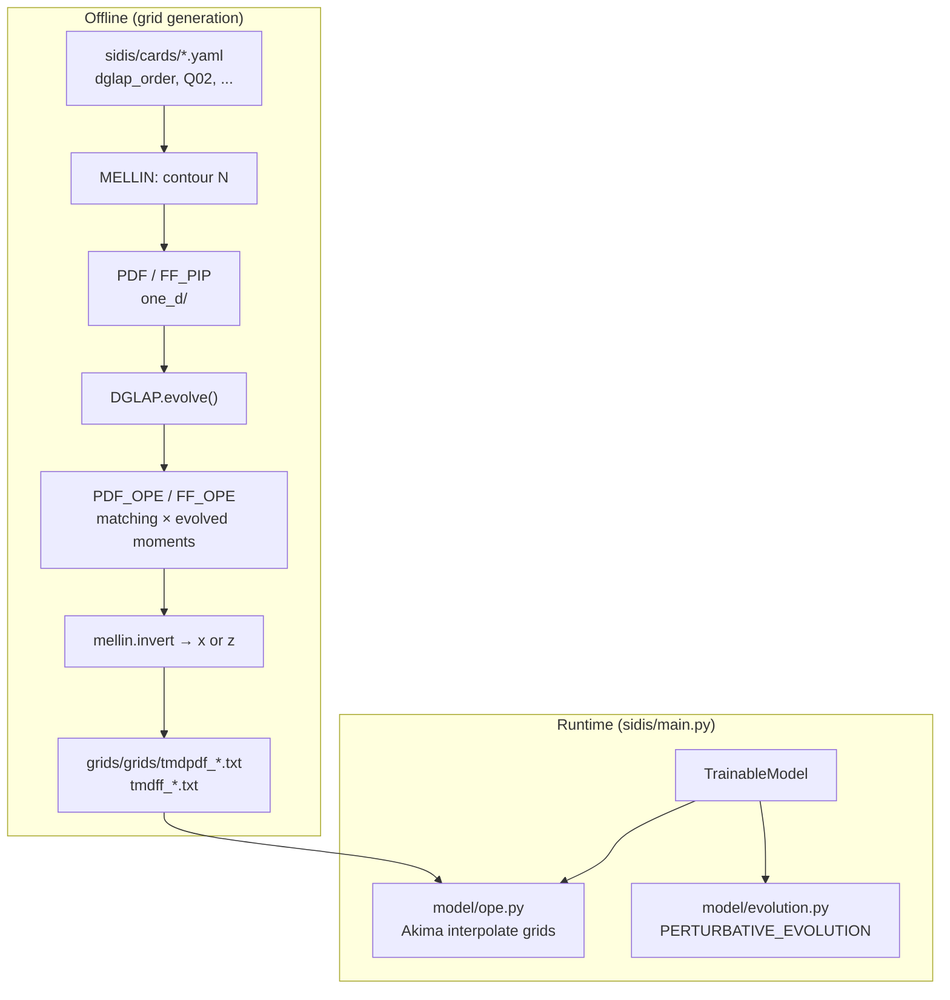

# DGLAP Evolution in the TMD / SIDIS Codebase

This document describes how **DGLAP** (Dokshitzer–Gribov–Lipatov–Altarelli–Parisi) collinear evolution is implemented and used in the [`quantom-collab/tmd`](https://github.com/quantom-collab/tmd) repository, with emphasis on the `sidis/` package.

**Scope:** The production DGLAP solver lives under `sidis/qcdlib/` and is driven by `sidis/one_d/`. It is used **offline** when building OPE grids, not during the runtime SIDIS forward pass (`sidis/main.py`). A separate, simplified Mellin-space DGLAP also appears in `spin/tmds.py` (Collins-fit legacy). The cloned [`jamx`](https://github.com/quantom-collab/jamx) package implements yet another DGLAP class (x-space matrices on a grid); that is noted briefly at the end.

---

## Table of contents

1. [Executive summary](#1-executive-summary)
2. [Where DGLAP runs in the pipeline](#2-where-dglap-runs-in-the-pipeline)
3. [Configuration and perturbative orders](#3-configuration-and-perturbative-orders)
4. [Mellin-space framework](#4-mellin-space-framework)
5. [Splitting kernels (`KERNELS`)](#5-splitting-kernels-kernels)
6. [Strong coupling (`ALPHAS`)](#6-strong-coupling-alphas)
7. [The `DGLAP` class](#7-the-dglap-class)
8. [PDF driver: `one_d/qcd_qcf_1d.py`](#8-pdf-driver-one_dqcd_qcf_1dpy)
9. [FF driver: `one_d/qcd_ff_1d.py`](#9-ff-driver-one_dqcd_ff_1dpy)
10. [Consumption in OPE grid generation](#10-consumption-in-ope-grid-generation)
11. [What is *not* DGLAP in this repo](#11-what-is-not-dglap-in-this-repo)
12. [Legacy / alternate implementations](#12-legacy--alternate-implementations)
13. [File reference](#13-file-reference)

---

## 1. Executive summary

| Aspect | Implementation |
|--------|----------------|
| **Space** | Mellin moment space \(N\) (complex contour); x-space only at the end via inversion |
| **Equation** | Standard DGLAP for unpolarized PDFs/FFs: \(\partial \ln Q^2 \, \tilde f(N,Q^2) = \alpha_s(Q^2)\, P(N) \otimes \tilde f(N,Q^2)\) |
| **Solver style** | Analytic evolution operators (PEGASUS-like), **truncated** mode by default |
| **Orders** | LO + NLO splitting (`dglap_order: 1`); NNLO splitting kernels exist in `KERNELS` but evolution operators are built through NNLO |
| **Flavor** | Singlet \((\Sigma, g)\) + non-singlet \((V, T_\pm)\) decomposition; active \(N_f\) = 3, 4, 5, or 6 per segment |
| **Thresholds** | PDF/FF: pre-evolve BCs \(Q_0^2 \to m_c^2 \to m_b^2\); on-demand evolution uses **fixed** \(m_c^2 \to Q^2\) at \(N_f=4\) |
| **Input PDFs/FFs** | Parametric JAM-style shapes in Mellin space, not LHAPDF grids |
| **When used** | `sidis/ope/generate_grids.py` → `PDF_OPE` / `FF_OPE` → text grids in `grids/grids/` |
| **Runtime SIDIS** | **No** DGLAP; reads precomputed OPE grids + **TMD CSS evolution** (`sidis/model/evolution.py`) |

---

## 2. Where DGLAP runs in the pipeline



**Call chain for collinear evolution at scale \(\mu_{b^*}^2\):**

1. `generate_grids.py` (or notebooks) builds `MELLIN`, `ALPHAS`, `PDF` / `FF_PIP`.
2. `PDF_OPE.get_OPE_TMDPDF` calls `pdf.evolve(mub**2)`.
3. `PDF.evolve` calls `self.dglap.evolve(self.BC4, self.mc2, Q2, 4)`.
4. Evolved Mellin moments are convolved with OPE coefficient functions and inverted to \(x\) (or \(z\)).

The runtime model never imports `DGLAP` directly.

---

## 3. Configuration and perturbative orders

Physics settings are loaded from unified YAML cards under `sidis/cards/` (e.g. `fNPconfig_simple.yaml`) via `config_loader.apply_physics()`.

Relevant keys:

| Key | Typical value | Meaning |
|-----|---------------|---------|
| `dglap_order` | `1` | Collinear DGLAP: `0` = LO, `1` = NLO |
| `alphaS_order` | `2` | \(\alpha_s\) running: used by `ALPHAS`, separate from DGLAP splitting order |
| `Q02` | `1.6384` | Reference scale \(Q_0^2 = m_c^2\) (GeV²) |
| `tmd_order` | `1` | OPE matching (NLO coefficient functions in `OPE.py`) |

`DGLAP` is constructed with:

```python
self.dglap = DGLAP(mellin, alphaS, self.kernel, 'truncated', cfg.dglap_order)
```

- **`mode='truncated'`** — IMODE=4 in PEGASUS terminology (expanded evolution operator in \(\alpha_s\)).
- **`mode='iterated'`** — IMODE=1 (alternative NLO singlet/non-singlet path); NNLO non-singlet iterated mode is **not implemented** (exits with error).

Default in `config_loader.DEFAULT_PHYSICS`: `dglap_order: 1`.

---

## 4. Mellin-space framework

**File:** `sidis/qcdlib/mellin.py`

### Transform definition

For a parton density \(f(x)\),

\[
\tilde f(N) = \int_0^1 dx\, x^{N-1} f(x).
\]

### Contour

The complex Mellin variable is sampled on a tilted contour (standard JAM/PEGASUS-style):

\[
N = c + Z\, e^{i\phi}, \quad c = 1.9,\; \phi = \frac{3\pi}{4}.
\]

- `Z` — Gauss–Legendre nodes on intervals `znodes = [0, 0.1, 0.3, …, 63]` (extended mode adds more tail points).
- `npts=8` — points per interval → total `len(N) = 8 × (len(znodes)-1)` (136 points with default nodes; **272** with `extended=True` as in `generate_grids.py`).

### Inversion

`MELLIN.invert(x, F)` implements the inverse transform along the contour:

```python
return np.sum(np.imag(self.phase * x**(-self.N) * F) / np.pi * self.W * self.JAC)
```

All DGLAP evolution acts on arrays `F` of length `Nsize = mell.N.size`. **No x-space convolution** is used inside `DGLAP.evolve`.

---

## 5. Splitting kernels (`KERNELS`)

**File:** `sidis/qcdlib/kernels.py`

`KERNELS(mellin, Type)` evaluates **analytic Mellin transforms** of splitting functions at each contour point `N`.

### Types used by 1d drivers

| Class | `Type` | Kernels loaded |
|-------|--------|----------------|
| `PDF` | `'upol'` | `load_unpolarized_spl()` — spacelike LO/NLO |
| `FF_PIP` | `'upol_ff'` | `load_unp_FF_spl()` — timelike LO/NLO |

### Objects exposed to `DGLAP`

After loading, the kernel holder provides:

| Symbol | Role |
|--------|------|
| `P[Nf, order, 2, 2, Nsize]` | Singlet evolution: couples **quark singlet** \(\Sigma\) and **gluon** \(g\) |
| `PNSP[Nf, order, Nsize]` | Non-singlet **plus** (\(T_+\)) |
| `PNSM[Nf, order, Nsize]` | Non-singlet **minus** (\(T_-\)) |
| `PNSV[Nf, order, Nsize]` | Non-singlet **valence** (\(V\)) |

`Nf` indexes active flavor count (3–6). `order` = 0 (LO), 1 (NLO), 2 (NNLO kernels are computed in `D` but evolution uses `self.order` from config).

LO/NLO unpolarized splitting functions are built from closed forms in \(N\) using `mpmath` polygamma functions (`psi`, `zeta`, etc.) — see `LO_unpolarized_splitting_functions()` and `NLO_unpolarized_splitting_functions()`.

---

## 6. Strong coupling (`ALPHAS`)

**File:** `sidis/qcdlib/alphaS.py`

DGLAP evolution uses \(\alpha_s(Q^2)\) through **\(a = \alpha_s/(4\pi)\)**:

```python
a  = self.asevo.get_a(Q2fin)
a0 = self.asevo.get_a(Q2ini)
```

### Beta functions

For each \(N_f\), `beta[Nf, k]` stores the first four coefficients of the QCD beta function (LO through 3-loop). `get_beta_matrix()` in `DGLAP` normalizes:

\[
b_{N_f, k} = \frac{\beta_{N_f,k}}{\beta_{N_f,0}}.
\]

### Running

- `evolve_a(mu0_sq, a, Q2, Nf)` — 20-step Runge–Kutta (PEGASUS-style) integrating \(da/d\ln Q^2 = \beta(a)\).
- Boundary: \(\alpha_s(M_Z)\) evolved down to `cfg.Q02` at **\(N_f=4\)** → stored as `self.a0`.
- **`get_Nf(Q2)`** currently returns **4 always** (charm threshold logic is commented out). So \(\alpha_s\) for DGLAP steps is always evolved in the \(N_f=4\) beta function, even when `DGLAP.evolve(..., Nf=3)` is used for flavor counting in splitting operators.

This is an important consistency detail: splitting operators use `Nf` passed to `evolve`, while `get_a` does not switch \(N_f\) with \(Q^2\) in the current code.

---

## 7. The `DGLAP` class

**File:** `sidis/qcdlib/dglap.py`

### Initialization

```python
DGLAP(mell, asevo, spl, mode='truncated', order=1)
```

1. Stores Mellin object, `ALPHAS`, and `KERNELS` (`spl`).
2. `get_beta_matrix()` — reduced beta coefficients `b[Nf, order]`.
3. `get_evolution_operators()` — precomputes:
   - `EO_NSP`, `EO_NSM`, `EO_NSV` from `spl.PNSP`, `PNSM`, `PNSV`
   - `EO_S` from `spl.P`

### Non-singlet evolution (`evolve_nonsinglet`)

For a single NS combination (one Mellin vector `qini` of length `Nsize`):

**LO operator:**

\[
L = \left(\frac{a}{a_0}\right)^{-R_{N_f,0}}
\]

where \(R_{N_f,0} = P_{N_f,0}/\beta_{N_f,0}\).

**Truncated NLO** (`order >= 1`):

\[
\text{operator} = L + (a - a_0)\, U_{N_f,1}\, L
\]

**Truncated NNLO** (`order >= 2`):

Additional terms in \(a^2, a a_0, a_0^2\) with \(U_{N_f,2}\).

**Iterated NLO** (non-singlet only at NLO):

\[
\text{operator} = L \exp\left(\frac{\ln\frac{1+b_1 a}{1+b_1 a_0}}{b_1}\, U_{N_f,1}\right)
\]

Returns `q = operator * qini` (element-wise in Mellin space).

### Singlet evolution (`evolve_singlet`)

The singlet sector is a **2×2** system in \((\Sigma, g)\) at each \(N\):

- Diagonalize LO generator: eigenvalues `rp`, `rm` and projectors `RP`, `RM`.
- Build \(L = (a/a_0)^{-r_p} R_P + (a/a_0)^{-r_m} R_M\).
- NLO/NNLO: matrix `U[Nf, order, 2, 2, Nsize]` contracted with `L` (truncated) or `UF @ L @ UM` (iterated, with higher-order `U1H` sums up to `itermax=16`).

Returns `q` as 2-vector `[qs, g]` per Mellin point.

### Master routine: `evolve(BC, Q2ini, Q2fin, Nf)`

**Inputs:**

- `BC` — boundary dictionary at scale `Q2ini` (see §8).
- `Q2ini`, `Q2fin` — evolution interval in GeV².
- `Nf` — **active flavor number** for this segment (3, 4, 5, or 6): selects which NS lines are evolved vs. copied.

**Steps:**

1. Copy BC fields: `vm`, `vp` (non-singlet combinations), `qv` (valence), `q` (singlet 2-vector).
2. Evolve `qv` with `EO_NSV`; evolve `q` with `EO_S`.
3. Depending on `Nf`, evolve subsets of `vm[k]`, `vp[k]` for \(k \in \{3,8,15,24,35\}\) (flavor-SU(3) weight lattice).
4. Reconstruct parton combinations `qp`, `qm` (plus/minus distributions per flavor).
5. Export flavor-resolved moments: `'u'`, `'d'`, `'s'`, `'g'`, `'ub'`, … and internal `vm*`, `vp*`.

**Docstring (explicit):**

> These are calculated in Mellin space (conjugate to x).

---

## 8. PDF driver: `one_d/qcd_qcf_1d.py`

### Role

`PDF` wraps DGLAP for **proton PDFs** used as collinear input to TMD OPE matching.

### Construction

```python
self.kernel = KERNELS(mellin, 'upol')
self.dglap = DGLAP(mellin, alphaS, self.kernel, 'truncated', cfg.dglap_order)
```

### Parametrization → Mellin moments

Each flavor component (e.g. `uv1`, `dv1`, `sea1`, `g1`) is

\[
f(x) \propto x^a (1-x)^b (1 + c\sqrt{x} + d x),
\]

normalized to the second Mellin moment. Moments on the full contour:

```python
mom = beta(N+a, b+1) + c*beta(N+a+0.5, b+1) + d*beta(N+a+1.0, b+1)
norm = beta(2+a, b+1) + ...
result = M * mom / norm
```

(`beta` is the Euler Beta function in `special.py`.)

### Sum rules

`set_sumrules()` fixes parameters:

- \(u\) valence number = 2, \(d\) valence = 1.
- Strange sum rule.
- Momentum sum rule fixes gluon normalization.

### Boundary conditions (`get_BC`)

1. Build `moms0` from `get_moments` for `g`, `up`, `um`, `dp`, `dm`, `sp`, `sm`.
2. **`BC3`** at \(N_f=3\): charm/bottom/top zeroed in `_get_BC`.
3. **`BC4 = dglap.evolve(BC3, Q02, mc2, 3)`** — evolve from \(Q_0^2\) to \(m_c^2\) with 3 active flavors in the **splitting** sense, then re-pack BC with charm on.
4. **`BC5 = dglap.evolve(BC4, mc2, mb2, 4)`** — step to \(m_b^2\) with 4 flavors.

These stored BCs support multi-threshold workflows; see below for what is actually used on demand.

### On-demand evolution (`evolve(Q2)`)

```python
self.storage[Q2] = self.dglap.evolve(self.BC4, self.mc2, Q2, 4)
```

**Current behavior (simplified):**

- Always starts from **`BC4`** (already evolved to \(m_c^2\)).
- Always evolves **`mc2 → Q2`** with **`Nf=4`**.
- Branches for \(Q^2 < m_c^2\), \(m_b^2\), etc. are **commented out**.

So for OPE grid generation at \(\mu_{b^*}^2 \gg m_c^2\), PDFs are DGLAP-evolved from charm threshold to \(\mu_{b^*}^2\) in the \(N_f=4\) scheme.

### x-space access (`get_xF`)

```python
if evolve: self.evolve(Q2)
return x * self.mellin.invert(x, self.storage[Q2][flav])
```

---

## 9. FF driver: `one_d/qcd_ff_1d.py`

### Role

`FF_PIP` — fragmentation functions for \(\pi^+\\) (same DGLAP machinery, timelike kernels).

### Differences from PDF

| Item | PDF | FF (`FF_PIP`) |
|------|-----|----------------|
| `KERNELS` type | `upol` | `upol_ff` |
| Parameters | valence/sea/gluon JAM PDF shapes | JAM FF shapes per `u1`, `d1`, … |
| `get_BC` at \(N_f=4\) | Full BC4 from evolution | After `BC4 = evolve(BC3,...)`, **injects** `cp, cm` from `moms['cp']` (not from evolution) |
| `evolve(Q2)` | Same: `BC4`, `mc2→Q2`, `Nf=4` | Same pattern; **clears `storage` every call** (`self.storage={}`) — no Q² cache |

Timelike splitting functions `PT0`, `PT1` replace spacelike `P0`, `P1` in `KERNELS`.

---

## 10. Consumption in OPE grid generation

**Files:** `sidis/ope/OPE.py`, `sidis/ope/generate_grids.py`

### Physics sequence at each \((x, b_T)\) or \((z, b_T)\)

1. **\(b^*\) prescription** (`MODEL_TORCH`): \(b^* = b_T/\sqrt{1+(b_T/b_{\max})^2}\), \(\mu_{b^*} = C_1/b^*\).
2. **DGLAP:** `pdf.evolve(μ_{b^*}^2)` → Mellin moments at \(\mu_{b^*}^2\).
3. **OPE matching (NLO):** Build \(C_q(N), C_g(N)\) with logs \(\ln(b^* \mu_{b^*})\), convolve:

   \[
   \tilde f_{\mathrm{OPE},i}(N) = C_q(N)\,\tilde f_i(N,\mu_{b^*}^2) + C_g(N)\,\tilde g(N,\mu_{b^*}^2)
   \]

4. **Mellin inversion** to \(x\) or \(z\).
5. **TMD evolution** (not DGLAP): multiply by `exp(K̃ + RGE)` from `PERTURBATIVE_EVOLUTION` to scale \(Q_0 = \sqrt{Q_{02}}\).
6. Write `grids/grids/tmdpdf_{flav}_Q_1.28.txt` and `tmdff_{flav}_Q_1.28.txt`.

### Separation of scales

| Scale | Mechanism |
|-------|-----------|
| \(\mu_{b^*}^2\) | **DGLAP** on collinear PDFs/FFs |
| \(Q_0^2 = m_c^2\) | **TMD CSS / RGE** resummation (grid-level factor) |
| Event \(Q^2\) | **PERTURBATIVE_EVOLUTION** in `TMDBuilder` (runtime) |

---

## 11. What is *not* DGLAP in this repo

| Component | File | What it does |
|-----------|------|----------------|
| Runtime OPE | `sidis/model/ope.py` | Interpolates **precomputed** `tmdpdf_*.txt` grids |
| TMD evolution | `sidis/model/evolution.py` | CSS/TMD anomalous dimensions, \(\gamma_F\), \(\gamma_K\), Sudakov |
| fNP / CS kernel | `sidis/model/fnp*.py`, `qcf0_tmd.py` | Non-perturbative TMD factors |
| `sidis/main.py` | — | No collinear evolution |

Confusingly, both collinear DGLAP and TMD resummation depend on \(\alpha_s\) and “evolution,” but they are different equations and different code paths.

---

## 12. Legacy / alternate implementations

### `spin/tmds.py`

- Standalone **LO** DGLAP in Mellin space for transversity/Collins:
  - `Pqqh1(n)` — LO splitting kernel in \(N\).
  - `DGLAP(n, Q)` — piecewise \(\prod (\alpha_s(Q)/\alpha_s(Q_i))^{-\gamma}\) across \(m_c, m_b\) thresholds.
- Uses **LHAPDF** for collinear `CxPDF` / `CxFF` in `TMDPDF` / `TMDFF` (no `sidis.qcdlib.dglap`).
- Not wired into `sidis/main.py`.

### `jamx` (`jamx/src/jamx/dglap.py`)

- Separate project: **x-space** evolution matrices \((2,2,n_x,n_x,n_{Q^2})\) with Gaussian quadrature convolutions.
- Precalculated grids; LO/NLO; used by `jamx.pdf` — not imported by `sidis`.

---

## 13. File reference

| File | Purpose |
|------|---------|
| `sidis/qcdlib/mellin.py` | Contour, `N`, `invert` |
| `sidis/qcdlib/kernels.py` | Mellin-space \(P_{ij}(N)\), LO–NNLO |
| `sidis/qcdlib/alphaS.py` | \(\alpha_s(Q^2)\), beta functions |
| `sidis/qcdlib/dglap.py` | `DGLAP` evolution operators and `evolve` |
| `sidis/qcdlib/config_loader.py` | `dglap_order`, `Q02`, … |
| `sidis/one_d/qcd_qcf_1d.py` | `PDF` class |
| `sidis/one_d/qcd_ff_1d.py` | `FF_PIP` class |
| `sidis/ope/OPE.py` | `PDF_OPE`, `FF_OPE` — calls `pdf.evolve` / `ff.evolve` |
| `sidis/ope/generate_grids.py` | Batch grid writer |
| `sidis/ope/README_OPE_grids.md` | Physics narrative for grids |
| `spin/tmds.py` | Legacy LO DGLAP + LHAPDF |

---

## Summary diagram: Mellin-space data flow

```
Parametric f(x)  ──get_moments──►  f̃(N) at Q₀²
                                      │
                    ┌─────────────────┼─────────────────┐
                    ▼                 ▼                 ▼
              dglap.evolve      dglap.evolve      (optional BC5)
              (Q₀²→m_c²,Nf=3)   (m_c²→m_b²,Nf=4)
                    │                 │
                    └────────► BC4 ◄──┘
                                  │
                    pdf.evolve(Q²): dglap.evolve(BC4, m_c², Q², Nf=4)
                                  │
                                  ▼
                         f̃_i(N, Q²)  ──OPE conv──►  invert ──► f_OPE(x,b_T)
```

For questions about extending flavor thresholds, aligning `ALPHAS.get_Nf` with `DGLAP.evolve`’s `Nf`, or enabling the commented multi-branch `evolve(Q2)` logic, inspect the commented blocks in `qcd_qcf_1d.py` / `qcd_ff_1d.py` and `alphaS.py`.

---

*Generated for the TMDs workspace (`tmd/sidis`). Last aligned with repository layout as of clone date.*
